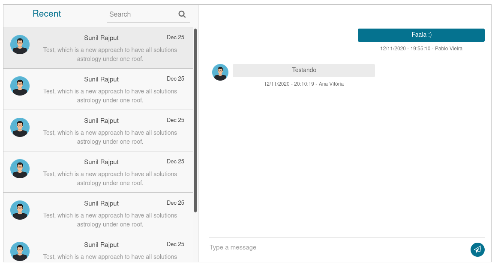

<h1 align="center">
  
</h1>

<h4 align="center">
  Projects done with youtube tutorials/references.
</h4>

 
 

### [Shawn C](https://www.youtube.com/c/ShawnChenTech)

- [Shopping Cart](https://github.com/pablomaribondo/shopping-cart)

  <kbd>
    
  </kbd>

### [Bruno Braga](https://www.youtube.com/channel/UCkwwsZDpcMxftRkDGql5xbw)

- [Auth Middleware](https://github.com/pablomaribondo/auth-middleware)

### [CodingFromScratch](https://www.youtube.com/channel/UCS2UjgEPEybOx1toY7aKRJg)

- [Notification](https://github.com/pablomaribondo/react-notification) - IN PROGRESS
- [Tooltip](https://github.com/pablomaribondo/react-tooltip) - IN PROGRESS
- [Quiz](https://github.com/pablomaribondo/react-quiz) - IN PROGRESS
- [Slider](https://github.com/pablomaribondo/react-slider) - IN PROGRESS
- [Image Directory](https://github.com/pablomaribondo/image-directory) - IN PROGRESS
- [Multilang Site - Redux](https://github.com/pablomaribondo/react-multilang-site-redux) - IN PROGRESS
- [Tags](https://github.com/pablomaribondo/react-tags) - IN PROGRESS
- [Select](https://github.com/pablomaribondo/react-select) - IN PROGRESS
- [Multilang Site - Context API](https://github.com/pablomaribondo/react-multilang-site-context-api) - IN PROGRESS
- [Countdown Timer](https://github.com/pablomaribondo/react-countdown-timer)

  <kbd>
    
  </kbd>

- [Multistep Form](https://github.com/pablomaribondo/react-multistep-form)
  
  <kbd>
    
  </kbd>

- [Table](https://github.com/pablomaribondo/react-table)

  <kbd>
    
  </kbd>

- [Modal](https://github.com/pablomaribondo/react-modal)

  <kbd>
    
  </kbd>

- [Accordion](https://github.com/pablomaribondo/react-accordion)
  
  <kbd>
    
  </kbd>

- [Calendar](https://github.com/pablomaribondo/react-calendar)

  <kbd>
    
  </kbd>

- [Pagination](https://github.com/pablomaribondo/react-pagination) - IN PROGRESS
- [Weather App](https://github.com/pablomaribondo/weather-app)

  <kbd>
    
  </kbd>

- [Photo Gallery](https://github.com/pablomaribondo/photo-gallery) - IN PROGRESS
- [Firebase Auth](https://github.com/pablomaribondo/react-firebase-auth)
  
  <kbd>
    
  </kbd>

- [Form Validation](https://github.com/pablomaribondo/react-form-validation)
  
  <kbd>
    
  </kbd>

- [Task List App](https://github.com/pablomaribondo/task-list-app)

  <kbd>
    
  </kbd>

### [K3dev](https://www.youtube.com/channel/UCZvzj47XJiTsMv2ZkBDRznQ)

- [Motorcycle Game](https://github.com/pablomaribondo/motorcycle-game)

  <kbd>
    
  </kbd>

### [Aldo Caamal](https://www.youtube.com/channel/UCsbBhGOM5l927nz5-jTIqlw)

- [Blog](https://github.com/pablomaribondo/blog)

  <kbd>
    
  </kbd>

### [ByProgrammers](https://www.youtube.com/channel/UC3_z0yLxjNQpgGoc5VWuV2A)

- [Plant App](https://github.com/pablomaribondo/plant-app-exploration) - IN PROGRESS

### [neecoder x](https://www.youtube.com/channel/UCtL_snE3VQQN_lAMefQYhMA)

- [To Do](https://github.com/pablomaribondo/todo-redux)

  <kbd>
    
  </kbd>

### [Brian Design](https://www.youtube.com/channel/UCsKsymTY_4BYR-wytLjex7A)

- [Form Validation](https://github.com/pablomaribondo/react-form-validation2)

  <kbd>
    
  </kbd>

- [Ultra](https://github.com/pablomaribondo/ultra)

  <kbd>
    
  </kbd>

- [Footer](https://github.com/pablomaribondo/react-footer)

  <kbd>
    
  </kbd>

### [Dev Soutinho](https://www.youtube.com/channel/UCzR2u5RWXWjUh7CwLSvbitA)

- [Flappy Bird](https://github.com/pablomaribondo/flappy-bird)

  <kbd>
    
  </kbd>

### [Diligent Dev](https://www.youtube.com/channel/UCLrTZVMYP_VsEyzxTAMcIcQ)

- [COVID-19 Data Visualization](https://github.com/pablomaribondo/covid19-visualization-vue)

  <kbd>
    
  </kbd>

### [The Net Ninja](https://www.youtube.com/c/TheNetNinja)

- [To Do](https://github.com/pablomaribondo/todo-app-react-testing-library) - IN PROGRESS
- [Game Guide](https://github.com/pablomaribondo/game-guide)

  <kbd>
    
  </kbd>

### [developer.school](https://www.youtube.com/channel/UCYJ9O6X1oFt7YGXpfRwrcWg)

- [Firebase CRUD](https://github.com/pablomaribondo/firebase-crud-vue)

  <kbd>
    
  </kbd>

### [Program With Erik](https://www.youtube.com/channel/UCshZ3rdoCLjDYuTR_RBubzw)

- [Firebase Auth](https://github.com/pablomaribondo/firebase-auth-vue)

  <kbd>
    
  </kbd>

- [Countdown Timer](https://github.com/pablomaribondo/countdown-vue)

  <kbd>
    
  </kbd>

### [Tyler Potts](https://www.youtube.com/channel/UCBBGM84ZOs7z5jpTQAaZ_Hg)

- [Timer Vue](https://github.com/pablomaribondo/timer-vue)

  <kbd>
    
  </kbd>

- [Timer JS](https://github.com/pablomaribondo/timer-js)

  <kbd>
    
  </kbd>

### [freeCodeCamp.org](https://www.youtube.com/channel/UC8butISFwT-Wl7EV0hUK0BQ)

- [FastAPI Course](https://github.com/pablomaribondo/fastapi-course)
- [Markdown Previewer](https://github.com/pablomaribondo/markdown-previewer-vue)

  <kbd>
    
  </kbd>

- [Tree Browser](https://github.com/pablomaribondo/tree-browser-vue)

  <kbd>
    
  </kbd>

- [Real-time Chat](https://github.com/pablomaribondo/firebase-chat-vue)

  <kbd>
    
  </kbd>

- [Game of Life](https://github.com/pablomaribondo/gameoflife)

  <kbd>
    
  </kbd>
